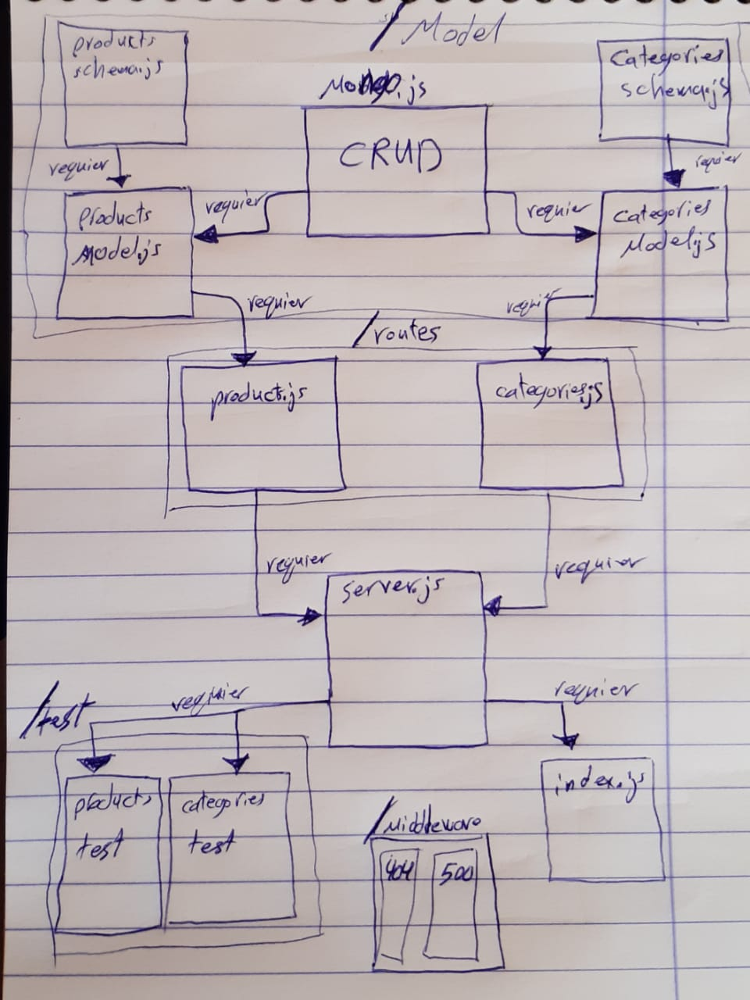

# express-routers

# LAB - Class 08

### Author: Ahmad Sawalqeh

### Links and Resources

- [submission PR](https://github.com/Ahmad-Sawalqeh/express-routers/pull/1)
- [ci/cd]() (GitHub Actions)

### Setup
run `npm i`

#### `.env` requirements (where applicable)
- `PORT` - 3000
- `MONGODB_URI` - mongodb://localhost:27017/class08

#### How to initialize/run your application (where applicable)
* run `npm start` to start the server
* run `npm test` to check all test.

#### Tests

- How do you run tests? 
  run `npm test`

# UML

